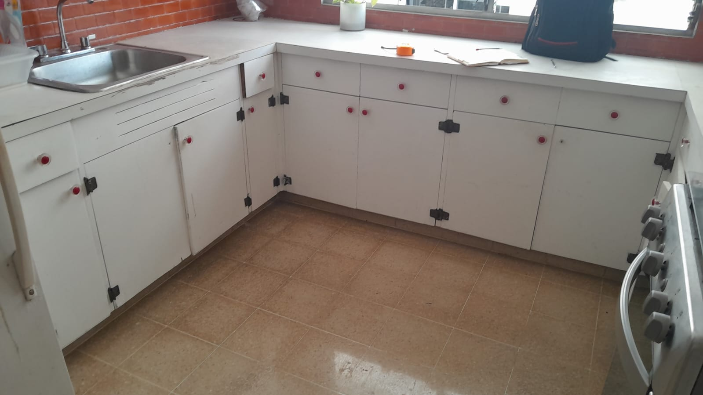
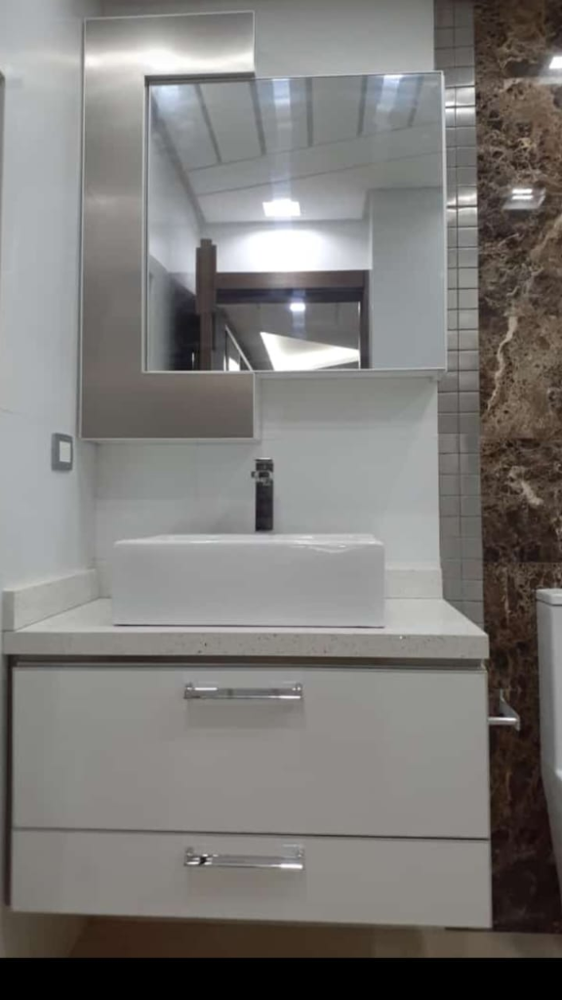

# 🪚 Landing Page — Ebanistería La Canopia

> Proyecto desarrollado durante el **Sprint 01** ([HU-S01-02](https://github.com/Fundacioncepav/impulsoDigital/blob/main/sprint-01/HU-S01-02-landing-negocio.md)) para el programa **Impulso Digital — Fundación CEPAV**.
> 
> 🌐 **Sitio Web en vivo:** [https://mariapaola21.github.io/landing-negocio/](https://mariapaola21.github.io/landing-negocio/)

---

## 📌 ¿Qué es el proyecto?

**Ebanistería La Canopia** es una landing page comercial, accesible, ligera y 100% *responsive* creada para un taller real de carpintería y ebanistería ubicado en **Turbo, Antioquia** (con cobertura en la región de Urabá y Medellín).

El sitio web actúa como el **portafolio digital oficial** del taller, ofreciendo:
* **Catálogo de trabajos reales:** Exhibición de proyectos fabricados a medida en madera maciza y tableros aglomerados RH (cocinas integrales, clósets, muebles de baño, carpintería para iglesias y acabados para edificios).
* **Galería interactiva:** Página secundaria ([`galeria.html`](file:///c:/Users/User/landing_negocio/galeria.html)) con catálogo fotográfico optimizado y categorizado.
* **Información del taller:** Horarios detallados de atención y tabla interactiva de servicios.
* **Contacto directo vía WhatsApp:** Botón flotante y llamadas a la acción (*CTA*) estratégicas con mensajes precargados para iniciar cotizaciones instantáneas.


## 👥 ¿Para quién es?

### 1. Para el Negocio (*Ebanistería La Canopia*):
* **Superar la dependencia del voz a voz:** Permite al taller atraer nuevos clientes fuera de su área tradicional y mantener un flujo constante de pedidos en temporadas bajas.
* **Vitrina profesional de bajo costo:** Proporciona un canal digital oficial con $0 COP de costo en hosting mediante GitHub Pages.
* **Centralización de ventas:** Canaliza las consultas de clientes directamente hacia la cuenta de WhatsApp de la administradora sin necesidad de administrar sistemas complejos.

### 2. Para los Clientes (Particulares, Administradores de Obras y Fincas):
* **Particulares y familias:** Personas en Turbo, Medellín o Urabá que buscan remodelar su hogar (cocinas integrales, clósets, baños) y desean verificar visualmente la calidad de las terminaciones antes de encargar.
* **Dueños de fincas y cabañas turísticas:** Clientes que requieren muebles resistentes a la humedad y el clima tropical mediante materiales en aglomerado RH y maderas tratadas.
* **Instituciones y comunidades (ej. iglesias):** Contratistas de proyectos en volumen (bancas, altares, puertas macizas) que valoran la seriedad, cumplimiento y trayectoria del taller.


## 🚀 Cómo correr el proyecto localmente

Para ejecutar y revisar el proyecto en tu máquina local sin instalar servidores ni frameworks complejos:

### Requisitos previos
* Un navegador web moderno (Google Chrome, Mozilla Firefox, Microsoft Edge, Safari).
* Git instalado (opcional, para clonar mediante terminal).

### Pasos de ejecución

1. **Clonar el repositorio:**
   ```bash
   git clone https://github.com/Mariapaola21/landing-negocio.git
   ```

2. **Ingresar al directorio del proyecto:**
   ```bash
   cd landing-negocio
   ```

3. **Abrir en el navegador:**
   * **Opción A (Directa):** Haz doble clic en el archivo [`index.html`](file:///c:/Users/User/landing_negocio/index.html) desde tu explorador de archivos.
   * **Opción B (Con VS Code Live Server):** Abre la carpeta en VS Code y haz clic en `Go Live` en la barra de estado (o clic derecho sobre `index.html` > *Open with Live Server*).
   * **Opción C (Galería):** Navega al archivo [`galeria.html`](file:///c:/Users/User/landing_negocio/galeria.html) para explorar la galería fotográfica.

---

## 📸 Capturas de Pantalla y Vista Previa

| Vista Principal (`index.html`) | Galería de Proyectos (`galeria.html`) |
| :---: | :---: |
|  |  |
| *Sección principal con catálogo de servicios y llamada a WhatsApp* | *Galería de proyectos con imágenes optimizadas y atributos alt* |

> 🔗 **Demostración interactiva en vivo:** [https://mariapaola21.github.io/landing-negocio/](https://mariapaola21.github.io/landing-negocio/)

---

## 💡 Decisiones Tomadas

Durante la planificación y desarrollo del sitio web se implementaron las siguientes soluciones y decisiones técnicas:

1. **Arquitectura Web Nativa (Sin Frameworks):**
   * Se utilizó **HTML5 semántico** y **CSS3 nativo** para garantizar máxima velocidad de carga, bajo peso de assets y cero costo de mantenimiento o vulnerabilidades por dependencias externas.

2. **Estrategia Mobile-First y Flexbox:**
   * El diseño fue construido empezando por dispositivos móviles (pantallas desde 320px) y escalando progresivamente con `@media` queries hasta 1440px.
   * Se utilizó **Flexbox** para layouts fluidos y adaptables, asegurando cero scroll horizontal (*RC-7*).

3. **Menú Hamburguesa Accesible en CSS Puro (Sin JS):**
   * Se implementó la navegación móvil utilizando la técnica de `input[type="checkbox"]` invisible y accesible mediante `:focus-visible`, permitiendo navegar el sitio 100% con teclado (`Tab` y `Espacio`) sin requerir scripts en JavaScript (*RC-9*).

4. **Accesibilidad y Estándares WCAG:**
   * Combinación de colores con alto contraste visual inspirados en tonos de madera maciza (`#4A2E1B`), aglomerado (`#2C3E50`) y verde de acción (`#25D366`).
   * Etiquetas semánticas puras (`<header>`, `<nav>`, `<main>`, `<article>`, `<section>`, `<footer>`) y atributos `alt` descriptivos en el 100% de las imágenes.

5. **Optimización de Recurso y Rendimiento:**
   * Compresión de imágenes por debajo de 150 KB con atributo `loading="lazy"` para acelerar la carga en redes móviles.
   * Calificación en **Lighthouse ≥ 90** en Accesibilidad y Buenas Prácticas y validación HTML libre de errores en el **W3C Nu Html Checker**.

6. **Integración Directa con WhatsApp como Canal de Conversión:**
   * Se sustituyeron los formularios de contacto tradicionales por un botón flotante y botones de llamada a la acción con enlaces directos a WhatsApp (`wa.me`) con mensajes pre-redactados para facilitar el contacto con la administradora.

---

## 🛠️ Tecnologías Utilizadas

* **HTML5:** Estructura semántica accesible.
* **CSS3:** Flexbox, variables CSS, micro-animaciones y diseño responsive.
* **Git & GitHub:** Control de versiones y ramas.
* **GitHub Pages:** Alojamiento estático gratuito con HTTPS.
* **Lighthouse & W3C Checker:** Auditorías de rendimiento, accesibilidad y calidad de código.

---

## 📄 Documentación Relacionada

* 📝 [negocio.md](file:///c:/Users/User/landing_negocio/negocio.md) — Estrategia de negocio, investigación, consentimiento (CA-3) y presupuesto de hosting (CA-14).
* 📖 [BITACORA.md](file:///c:/Users/User/landing_negocio/BITACORA.md) — Registro diario de aprendizaje y construcción del Sprint 01.
* 🎙️ [investigacion/entrevista.md](file:///c:/Users/User/landing_negocio/investigacion/entrevista.md) — Entrevista a la administradora y evidencias.
